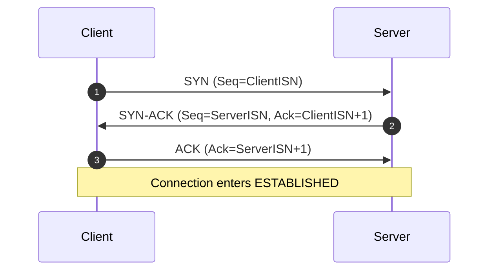

# RUDP Protocol (v1.1)

Status: Draft (implementation-targeted)
Transport: UDP
Scope: Packet-based transport with channel-level delivery semantics

---

## 1. Overview

RUDP is a lightweight transport protocol built on top of UDP.

It separates delivery semantics at the channel level while sharing a common connection model and reliable sequence space.

RUDP targets:

* Real-time control systems
* Interactive game networking
* IoT control scenarios

### Non-goals (v1.1)

* Congestion control
* Encryption
* Packet aggregation
* Fragmentation

---

## 2. Connection Model

Although UDP is connectionless, RUDP defines a logical connection.

* Peers are symmetric after establishment.
* `ConnId` is a 32-bit identifier assigned by the server.
* Sequence spaces are per direction.
* A reliable sequence space always exists at the connection level.

---

## 3. Packet Format

One RUDP packet maps to one UDP datagram.

* Byte order: **big-endian**
* Fixed header length: **28 bytes**
* Payload length: `udp_datagram_len - HeaderLen`

### 3.1 Fixed Header (28 bytes)

| Field       | Offset | Size | Type   | Description                |
| ----------- | ------ | ---- | ------ | -------------------------- |
| ConnId      | 0      | 4    | uint32 | Connection identifier      |
| Seq         | 4      | 4    | uint32 | Reliable sequence number   |
| Ack         | 8      | 4    | uint32 | Cumulative ACK             |
| AckBits     | 12     | 8    | uint64 | Selective ACK bitmap       |
| ChannelId   | 20     | 4    | uint32 | Logical channel identifier |
| ChannelType | 24     | 1    | uint8  | See §6                     |
| Flags       | 25     | 1    | uint8  | See §4                     |
| HeaderLen   | 26     | 1    | uint8  | MUST be 28                 |
| Reserved    | 27     | 1    | uint8  | MUST be 0                  |

### 3.2 Validation

* `HeaderLen MUST equal 28`
* `Reserved MUST equal 0`

---

## 4. Flags

| Bit  | Name     | Meaning                    |
| ---- | -------- | -------------------------- |
| 0x01 | SYN      | Handshake start            |
| 0x02 | FIN      | Graceful connection close  |
| 0x04 | RST      | Immediate connection abort |
| 0x08 | PING     | Keepalive request          |
| 0x10 | PONG     | Keepalive reply            |
| 0x20 | ACK      | Generic acknowledgment     |

Ack and AckBits fields are always present.

---

## 5. Reliable Sequence Space

### 5.1 Reliable-only sequence numbers

* `Seq` increments only for reliable packets.
* Non-reliable packets MUST set `Seq = 0`.
* Handshake and control frames consume reliable sequence numbers.
* `Ack` and `AckBits` apply only to the reliable sequence space.

Reliable state (Ack/AckBits, receive bitmap, retransmission queue) MUST be updated only for packets whose ChannelType is:

* RELIABLE_ORDERED
* RELIABLE_UNORDERED
* or connection-level control frames (handshake/FIN)

For non-reliable packets (UNRELIABLE), the receiver MUST ignore the `Seq` field for all reliability-related processing.

This ensures the 64-bit AckBits window is dedicated exclusively to tracking reliable delivery.

---

### 5.2 Wrap-around comparison

All sequence comparisons MUST use modulo-2^32 arithmetic.

Recommended implementation:

```
seq_lt(a,b)  := (int32)(a - b) < 0
seq_le(a,b)  := (int32)(a - b) <= 0
```

---

### 5.3 Cumulative ACK

`Ack` represents the next expected reliable sequence number.

All packets with:

```
seq < Ack
```

are considered received.

---

### 5.4 Selective ACK (AckBits)

AckBits is a 64-bit bitmap.

* Bit 0 is the least significant bit (LSB).
* Bit `i` corresponds to `seq = Ack + i + 1`.
* A set bit (1) indicates that sequence number has been received.

The receiver can represent up to 64 packets beyond Ack.

---

### 5.5 Reliable in-flight window limit

The sender MUST NOT have more than 64 unacknowledged reliable packets.

Before sending a new reliable packet:

```
(NextSeq - AckRemote) <= 64
```

If the window is full, the sender MUST stall reliable sends until Ack advances.

If `Ack` does not advance while `AckBits` indicates the window beyond `Ack` is fully received, the connection is experiencing a persistent gap at `Ack` (head-of-line gap in the reliable sequence space).

The sender WILL stall due to the in-flight window limit.

Progress requires:

* successful retransmission of the missing packet, or
* connection failure per §8.1.

---

## 6. Channel Types

Channel configuration is static during the lifetime of a connection.

ChannelType MUST NOT change at runtime.

| ChannelType | Name               | Reliable | Ordered |
| ----------- | ------------------ | -------- | ------- |
| 0           | RELIABLE_ORDERED   | Yes      | Yes     |
| 1           | RELIABLE_UNORDERED | Yes      | No      |
| 2           | UNRELIABLE         | No       | No      |

---

### 6.1 Delivery Semantics

* RELIABLE_ORDERED: delivered in order; head-of-line blocking applies.
* RELIABLE_UNORDERED: delivered immediately upon receipt.
* UNRELIABLE: best-effort delivery.

---

## 7. Handshake (Three-way)

States:

* CLOSED
* SYN_SENT
* SYN_RECEIVED
* ESTABLISHED

### 7.1 ISN

Each peer selects a random 32-bit Initial Sequence Number.

Handshake packets consume reliable sequence numbers.

---

### 7.2 Handshake Flow



---

### 7.3 Handshake Linger

After sending the final handshake ACK, a peer SHOULD retain minimal handshake state for a short linger period (e.g., 2×RTT or a fixed timeout).

If a duplicate SYN-ACK is received during this period, the peer SHOULD resend the final ACK.

---

## 8. Retransmission

Reliable packets MUST:

* Be stored until acknowledged
* Be retransmitted on:

  * Timeout (RTO)
  * Gap detection via AckBits (Fast Retransmit)

Implementations SHOULD use gap detection to trigger early retransmission.

RTO remains the primary fallback mechanism and SHOULD apply exponential backoff.

---

### 8.1 Retransmission Failure Policy

Reliable delivery is strict.

A reliable packet is either acknowledged or the connection fails.

Implementations MUST enforce at least one of:

* A maximum retransmission count
* A maximum retransmission age

If exceeded:

* The implementation MUST report a connection error
* The connection state MUST be discarded

Implementations MAY fail fast based on retransmission statistics but MUST NOT silently drop reliable packets.

---

## 9. Termination

### 9.1 FIN

FIN is a connection-level control frame.

* FIN consumes a reliable sequence number.
* FIN MUST be acknowledged.
* FIN is retransmitted until acknowledged.
* Half-close is not supported.

---

### 9.2 RST

RST immediately aborts the connection.

No acknowledgment is required.

---

## 10. Liveness

Connections use implementation-defined idle timeout.

PING/PONG MAY be used as keepalive.

---

## 11. Transport Constraints

Implementations SHOULD avoid IP fragmentation.

A conservative default is to keep each UDP datagram (including the 28-byte RUDP header) within the path MTU (typically 1200–1400 bytes).

---

## 12. Implementation Requirements

### 12.1 Codec

* Big-endian encoding
* Explicit offset read/write
* No struct memcpy layout assumptions

### 12.2 Required Tests

* Encode/decode round-trip
* Endianness verification
* Short buffer failure
* Header validation
* Wrap-around sequence comparison
* Ack window boundary behavior
* Retransmission timeout behavior
* MTU size enforcement

---

## 13. Versioning

v1.1 fixes:

* HeaderLen = 28
* AckBits = 64
* Reliable window size = 64
* Reliable-only sequence space

Future versions MAY extend header via HeaderLen.
