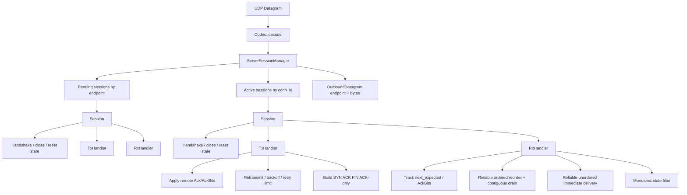

# Architecture

## Notes

- `ServerSessionManager` owns multi-session concerns:
  - new-peer session creation
  - global `conn_id` allocation
  - pending-to-active promotion
  - active dispatch
  - terminal cleanup
- `Session` owns per-connection meaning:
  - lifecycle state machine
  - transport ACK processing
  - channel delivery semantics
  - handshake linger and FIN acknowledgement behavior
- `poll_tx()` at the manager layer currently collects at most one datagram per
  pending session and one datagram per active session per poll cycle.
