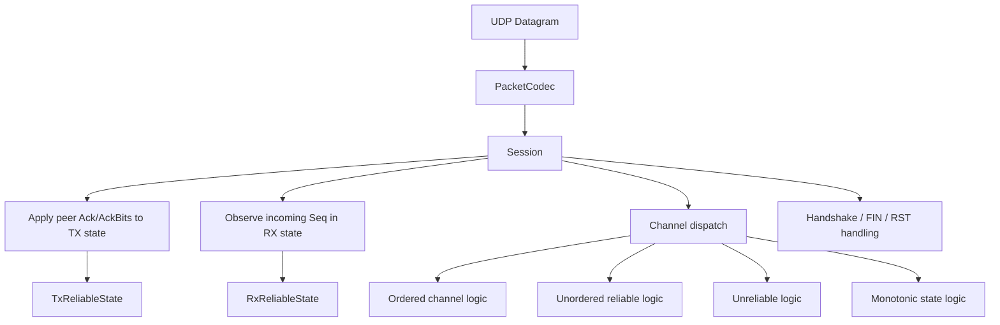

# Architecture

```mermaid
flowchart TD
    Udp[UDP Datagram] --> Codec[PacketCodec]
    Codec --> Session[Session]

    Session --> TxAck[Apply peer Ack/AckBits to TX state]
    Session --> RxSeq[Observe incoming Seq in RX state]
    Session --> Channel[Channel dispatch]
    Session --> Lifecycle[Handshake / FIN / RST handling]

    TxAck --> TxState[TxReliableState]
    RxSeq --> RxState[RxReliableState]

    Channel --> Ordered[Ordered channel logic]
    
    Channel --> Unordered[Unordered reliable logic]

    Channel --> Unreliable[Unreliable logic]

    Channel --> Mono[Monotonic state logic]
    
```